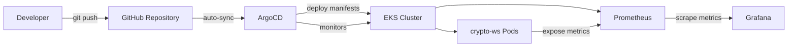

# GitOps Observability Platform


## Overview

This project is to build a a GitOps observability solution that consists of ArgoCD, Grafana and Prometheus to solve the problem of robust and automated deployment of application and infrastructure, with enhancements in observability and auditability.

## Problem Statement

Traditional deployment processes suffer from:
- Manual kubectl commands prone to human error
- Lack of deployment audit trails
- Configuration drift between environments
- No automated rollback on failures

## Solution

This project implements a GitOps approach where:
- Git is the single source of truth
- ArgoCD automatically syncs cluster state
- All changes are auditable via Git history
- Drift detection and auto-remediation are built-in

## Architecture


**Source → Sync → Deploy → Monitor**

1. **Source Control**: Developers push Kubernetes manifests and application configs to Git
2. **ArgoCD Sync**: ArgoCD monitors the Git repository and detects changes
3. **Automated Deployment**: Changes are automatically applied to the EKS cluster
4. **Drift Detection**: ArgoCD ensures cluster state matches Git (single source of truth)
5. **Metrics Collection**: Prometheus scrapes metrics from applications and cluster components
6. **Visualization**: Grafana displays real-time dashboards and alerts

### Components

- **Infrastructure as Code**: 
EKS and IAM infrastructure are created via terraform in modulars. The design has capacity to deploy to both dev and prod environment.
Default region of EKS is ap-southeast-1 and it is configurable. 
- **GitOps**: 
ArgoCD is deployed as a service via kubernetes in Argocd namespace, for the purpose of continuous deployment and synchronization of Kubernetes resources from Git repository. Orchestration that includes drift detection and rollback is enabled.
- **Observability Stack**: 
Grafana and Prometheus are deployed as a service via kubernetes in argocd, as a UI dashboard to offer better monitorability. This is deployed in another namespace but offers cross-namespace monitoring.
- **Sample Application**: 
Crypto-ws is attached as sample application that listens to real-time market data Websocket, and orchestrated in multi-stage Docker build. The Docker build process is available for both dev and prod environment.

## Tech Stack

### Infrastructure
- **AWS EKS 1.34** - Managed Kubernetes control plane
- **Terraform** - Infrastructure as Code with modular design (EKS, IAM, VPC)
- **EC2 t3.medium** - Worker node instances with auto-scaling (2-6 nodes)
- **VPC CNI v1.18.1** - AWS VPC networking for Kubernetes pods

### Kubernetes & GitOps
- **Kubernetes 1.34** - Container orchestration via Amazon EKS
- **ArgoCD** - GitOps continuous delivery and declarative configuration management
- **kubectl** - Kubernetes CLI for cluster management
- **RBAC** - Role-based access control for cluster security

### Monitoring & Observability
- **Prometheus v2.54.1** - Metrics collection, storage, and alerting
- **Grafana v11.2.0** - Visualization dashboards and monitoring
- **ServiceMonitor CRDs** - Prometheus Operator custom resources for service discovery
- **Kubernetes Metrics** - Node, pod, and container resource monitoring

### Application
- **Python 3.11** - Application runtime
- **Docker Multi-stage Builds** - Optimized container images with security best practices
- **WebSockets 12.0+** - Real-time bidirectional communication
- **aiohttp 3.9.0+** - Async HTTP client/server framework
- **PyYAML 6.0+** - Configuration management
- **pytest 7.4.0+** - Testing framework

## Project Structure

```
gitops-observability/
├── terraform/              # Infrastructure as Code
│   ├── modules/           # Reusable Terraform modules
│   │   ├── eks/          # EKS cluster configuration
│   │   └── iam/          # IAM roles and policies
│   └── live/             # Environment-specific configs
│       ├── dev/          # Development environment
│       └── prod/         # Production environment
├── k8s/                   # Kubernetes manifests
│   ├── argocd/           # ArgoCD installation & applications
│   │   └── applications/ # ArgoCD Application CRDs
│   └── monitoring/       # Prometheus & Grafana stack
└── crypto-ws/            # Sample cryptocurrency websocket application
```

## Prerequisites

- Docker installed
- AWS CLI credential configured
- kubectl installed

### 1. Clone the Repository

```bash
git clone git@github.com:bennyleungyc/gitops-observability.git

```

### 2. Set Up Infrastructure

Run these commands from the project root directory:

```bash
# Initialize IAM module
terraform -chdir=terraform/modules/iam init

# Initialize EKS module
terraform -chdir=terraform/modules/eks init

# Initialize and apply dev environment
terraform -chdir=terraform/live/dev init
terraform -chdir=terraform/live/dev plan -var-file="dev.tfvars"
terraform -chdir=terraform/live/dev apply -var-file="dev.tfvars"
```
####  2.1 Configure kubectl for EKS

After Terraform creates the EKS cluster, update your kubeconfig:

```bash
aws eks update-kubeconfig  --name dev-argocd-eks-cluster --region ap-southeast-1
```
#### 2.2 Terraform state uploaded to S3 for collaboration
Terraform state is stored remotely in S3 to enable team collaboration and prevent state conflicts. For easier setup, S3 creation is manually created. One of potential improvements is to provision S3 bucket via Terraform.


### 3. Deploy ArgoCD

Run these commands from the project root directory:

```bash
kubectl create namespace argocd
kubectl apply -f k8s/argocd/ -n argocd

# Verify ArgoCD pods are running
kubectl get pods -n argocd
```

### 4. Deploy Monitoring Stack

Run these commands from the project root directory:

```bash
kubectl create namespace monitoring
kubectl apply -f k8s/monitoring/ -n monitoring

# Verify Monitoring pods are running
kubectl get pods -n monitoring
```

### 5. Deploy market data listener

Run these commands from the project root directory:
At helm_chart/, 
```bash
helm dependency update ./crypto-ws-subscriber
helm dependency update ./binance-ws-subscriber

## Verify dependecy is updated
helm dependency list ./binance-ws-subscriber
helm dependency list ./crypto-ws-subscriber

helm install crypto-ws-subscriber ./crypto-ws-subscriber
helm install binance-ws-subscriber ./binance-ws-subscriber

## Test deployment and testing pod will be created.
helm test crypto-ws-subscriber
helm test binance-ws-subscriber
```


## Accessing Services

### ArgoCD UI
```bash
kubectl port-forward svc/argocd-server -n argocd 8080:443
```
- Access ArgoCD via 127.0.0.1:8080

### Grafana Dashboard
```bash
kubectl port-forward svc/grafana -n monitoring 3000:80
```
- Access Grafana via 127.0.0.1:3000

### Prometheus
```bash
kubectl port-forward svc/prometheus -n monitoring 9090:9090
```
- Access Prometheus via 127.0.0.1:9090

## Configuration

### Terraform Variables

1. Access to EKS of AWS account is needed to put in dev.tfvars. Follow `dev.tfvars.example` for example.

### ArgoCD Applications

#### Add Applications manually
1. Look for password of admin account
```bash
kubectl -n argocd get secret argocd-initial-admin-secret -o jsonpath="{.data.password}" | base64 -d
```
2. Login with admin account
3. Add new repository
4. Add application
   1. Configure application name
   2. Put repository details
   3. For path, put the relative path where Kubernetes yaml exists.
   5. For Cluster URL, put `https://kubernetes.default.svc`
   6. Click Generate
5. Verify the application configuration
    1. Application shows in homepage
    2. Sync status of application will be shown 
        1. If not sync, the synchronisation will be started automatically

#### Bonus: Add Applications manually via MCP
1. Get started with Amazon Q Developer in AWS panel (available only in us-east-1 and eu-central-1 as at Nov 2025)
2. Install Amazon Q plugin in IDE (available in Visual Studio Code and JetBrains)
3. Configure  ~/.aws/amazonq/mcp.json
    1. Put ARGOCD_BASE_URL as http://127.0.0.1:8080
    2. Put ARGOCD_API_TOKEN for your account
    3. Please make sure the ArgoCD policy is set for your account to read and edit application
4. Add Git repository manually (like mentioned above)
5. Open Amazon Q chat and add application in natural language
    1. Example: `Add ArgoCD application with RepoUrl: https://github.com/bennyleungyc/gitops-observability and path k8s/deployments`
6. Verify the new application


---

